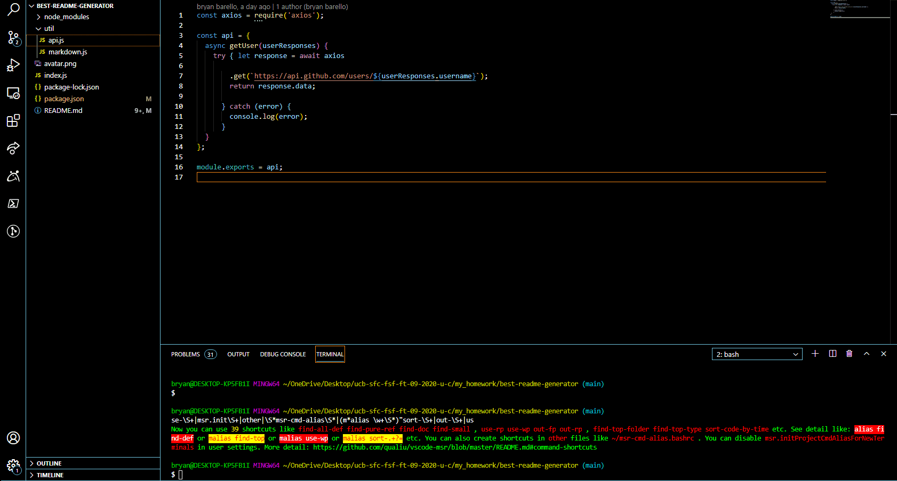

# Best Readme.md Generator

## Description 
    
From the command line a user can generate a readme.md file bases on the users GitHub username and other 
information pertaining to the project. This application dynamically generates a README.md based on a user's input. 

## Table of Contents
  - [Title](#best-readme-generator)
  - [Description](#description)
  - [Table of Contents](#table-of-contents)
  - [Installation](#installation)
  - [Usage](#usage)
  - [Methodology](#methodology)
  - [Demo](#demo)
  - [License](#license)
  - [Questions](#questions)
  

## Installation

To generate your own README, first run `npm install` in order to install the following npm package dependencies as specified in the `package.json`:
  * [`inquirer`](https://www.npmjs.com/package/inquirer) that will prompt you for your inputs from the command line 
  * [`axios`](https://www.npmjs.com/package/axios) to fetch your info from the GitHub API

The application itself can be invoked with `node index.js`.

## Usage 

When you run `node index.js`, the application uses the `inquirer` package to prompt you in the command line with a series of questions about your GitHub and about your project.

The application then takes your responses and uses `axios` to fetch your GitHub profile from the [GitHub API](https://developer.github.com/v3/), including your GitHub profile picture (avatar) and email.
From there, the application will generate markdown and a table of contents for the README conditionally based on your responses to the Inquirer prompts (so, if you don't answer the optional questions, such as Installation, an Installation section will not be included in your README). The README will also include badges for your GitHub repo.

Lastly, the `fs.writeFile` is used to generate your project's README.md file. 

## Methodology

The application utilizes modularization by separating the GitHub API call and generation of the markdown into separate modules: `api.js` and `markdown.js` inside the `utils` folder.

The application also utilizes, as much as possible, syntax and paradigms introduced in ES6, including `arrow functions`, `const`, `let`, template literals, and `async/await` to handle the `inquirer`, `axios`, and `fs.writeFile` promises.

## Demo

## License

UC Berkeley

---

## Questions

 

GitHub: [@bbarello](https://api.github.com/users/bbarello)

Email: bryanbarello@gmail.com